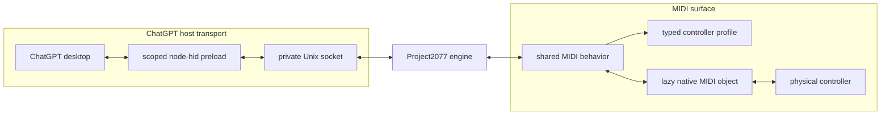

# Architecture

`codex-minilab3` has three replaceable boundaries:

```text
ChatGPT host transport <-> Project2077 engine <-> MIDI surface
```

Each changes for a different reason. ChatGPT may change its private device
integration, the emulated Codex Micro protocol may evolve, and every MIDI
controller has different messages and lighting. Code crosses a boundary only
through the small contract required by the adjacent layer.



## ChatGPT host transport

Manual launch loads a dependency-free CommonJS preload into one ChatGPT
process tree without modifying or re-signing ChatGPT.app. The preload:

- intercepts only the Work Louder device kit's `node-hid` load;
- adds one synthetic Project2077 descriptor;
- delegates real HID devices and unrelated `node-hid` behavior unchanged;
- gives a physical device with the same VID/PID precedence;
- carries canonical 64-byte reports without parsing Project2077 JSON.

The current transport is versioned NDJSON over a private Unix socket. Manual
launch uses a random per-launch token before reports are accepted; direct
bridge mode relies on directory and socket permissions. Messages are processed
in stream order, so no second sequence-numbering mechanism is needed. Manual
launch removes the socket and token when ChatGPT exits. It also passes the exact
app bundle path to the bridge. A mapped button press activates that running app
before its HID event is sent; releases and encoder rotation do not activate it.

Host connect and disconnect callbacks are required. The bridge opens the MIDI
controller only while a protocol-valid ChatGPT host is connected, then releases
it when that host leaves.

An RP2040/ESP32-S3 relay or approved CoreHID implementation can replace this
transport while retaining the raw-report contract and leaving the engine and
controller profiles unchanged.

## Project2077 engine

The engine emulates Codex Micro independently of Electron, sockets, MIDI, and
MiniLab 3. It consumes and produces raw HID reports and exposes normalized controller
events and lighting state.

Project2077 uses report ID `6`, channel `2` for JSON-RPC, a payload-length byte,
and up to 61 bytes of UTF-8 payload in each 64-byte report. The engine
reassembles requests, frames responses, emits `v.oai.hid` key events and
`v.oai.rad` joystick events, and explicitly rejects unknown RPC methods.

The emulated device reports firmware `0.3.0`, battery `100`, and charging
`true`. These are compatibility constants, not runtime or test configuration.
Supported calls are:

| Method | Result or effect |
| --- | --- |
| `sys.version` | Emulated firmware version |
| `device.status` | Emulated battery and charging status |
| `v.oai.thstatus` | Six task-light records |
| `v.oai.rgbcfg` | Key and ambient lighting configuration |

The engine knows nothing about MIDI notes, controller ports, native modes, or
how ChatGPT was launched.

## MIDI surface

The controller area is intentionally small:

```text
src/controllers/
├── index.ts                 typed map and controller construction
├── controller-profile.ts    controller-author contract
├── midi-surface.ts          shared connection and input behavior
└── minilab3/
    ├── index.ts             hardware-tested Arturia MiniLab 3 adapter
    └── spectrum/            named audio-analysis and lighting experiments
```

`controller-profile.ts` is a shallow authoring contract. `midi-surface.ts` is
the deep implementation: it owns Note/CC decoding, release handling,
reference-counted aliases, joystick state, relative-encoder pacing, connection
loss, forced releases, reconnect, lighting caching, and replay. Keeping the
contract separate means a controller contributor does not need to understand
the state machine to declare a profile.

Profiles are listed explicitly in the typed map in `src/controllers/index.ts`.
There is no directory scan or dynamic import. A profile is authoritative for:

- default exact input and optional output ports;
- note, CC, joystick, and relative-encoder mappings;
- synchronous vendor connection behavior;
- complete lighting frames for every controlled light, including explicit OFF
  frames.

Repeated destinations are aliases. Encoder configuration is one coherent
declaration containing its CC, direction values, pulses per step, cooldown, and
sequence timeout. A reconnect is attempted once per second. Vendor behavior
stays private in the controller's single `index.ts`.

Profiles may request a low-frequency replay of unchanged lighting for hardware
whose idle screensaver otherwise overrides host-controlled colors.

Only `src/midi/index.ts` imports `@julusian/midi`. Its lazy `midi` object owns
port enumeration, exact port selection, subscriptions, output, and cleanup.
Tests may create an injected backend, but application code does not wrap the
library again. The raw monitor opens only the selected input.

## Configuration and lifecycle

Public JSON configuration contains an optional bridge socket path, controller
profile ID, exact MIDI input/output overrides, and a named MiniLab lighting
preset. Mappings and vendor protocols remain TypeScript so profiles stay
readable and reviewable.

On MIDI or host disconnect, the bridge releases held logical inputs, closes
native handles, resets partial protocol state, and waits to reconnect or exit.
A successful reconnect re-enters the vendor session and replays current
lighting. Stateful I/O stays at the edges; decoding, rendering, and protocol
framing remain pure where practical.

## Verification

`npm run verify` builds both Swift helpers, type-checks the project, and runs
all tests. Bun orchestrates a real Node subprocess for the CommonJS preload
compatibility coverage.

Generic tests cover shared MIDI, Project2077, socket, dormancy, and preload
contracts. The bundled MiniLab 3 additionally has a black-box regression through
public controller construction because it is the reference adapter. It tests
behavior from raw MIDI and rendered output rather than copying the profile
object or importing private helpers.

Future controller-specific automated tests are optional when a profile has
genuine vendor behavior worth preserving. Physical acceptance is never
optional: support is claimed only after every mapped control, lighting state,
reconnect path, and clean shutdown has been exercised on the device and
documented.

See [Adding a controller](adding-a-controller.md) for that workflow and
[Provenance](provenance.md) for evidence rules.
